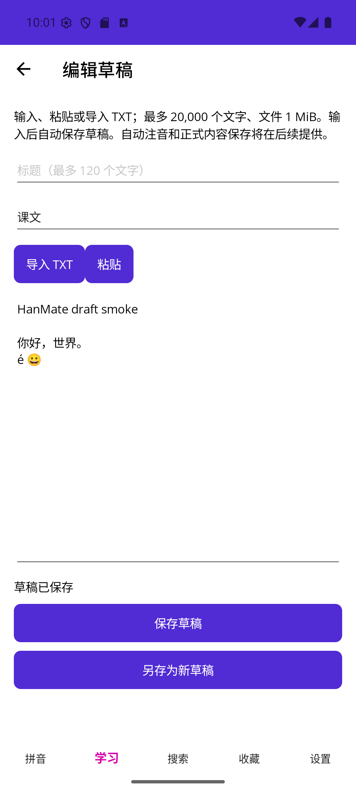

# W2-02 / W2-06 / W3-01 分类、收藏与文字草稿

2026-09-17。用户授权连续实施并在最后集中测试。本轮交付三个工作包，17/48 DONE；无Git元数据，没有清库或更改正式素材审校状态。

## 实现

- LearningCatalogStore：场景选项OR，其余难度/学段/年级/个人来源AND；仅个人及启用存在learning来源，排除dictionary/retained/removed。参数化查询，列表和总数同读事务，50条分页、稳定标题/ID排序。LearningBrowserPage支持折叠条件、清除、未有内容/筛选无匹配两种空状态及阅读。
- FavoriteStore/FavoriteMembershipStore：系统默认夹，名称1—40文本元素、说明300；Unicode规范化/不区分大小写同名拒绝。新建、编辑、排序、删除；一次提交多夹集合，同夹去重，未变关系不重写时间和排序。删除夹只改关系，推进membership_revision，失败整体回滚；默认夹禁止删除。四类/字典阅读器均接收藏选择器，收藏中显示来源停用/撤下/保留状态。
- ReadingPreferenceStore：SQLite合并拼音开关/100%—200%缩放，保留语言及未知键；乐观并发重试。内部reading.scale不是完整备份settings.schema对象，导出须另行显式转换。
- TextDraftInput/TextDraftStore/TextDraftPage：UTF-8（有/无BOM）、UTF-16 LE/BE（带BOM）严格解码，不使用替换字符吞错。文件1MiB、正文20,000文本元素、标题120；流读取并实际计数，保留换行/空行/组合字符。输入/粘贴、四类目标意图、自动保存/手动保存/另存、草稿列表/恢复/删除。SQLite修订防冲突，已有原文替换确认，导入期间输入改变则拒绝覆盖，错误/取消保留输入。
- 内部草稿format=textDraft.v1，尚不生成注音、正式内容或语法表单；不放入学习/搜索集合。Shell离开等待保存，可取消导航保存失败时留在编辑页；生命周期保存仍不能保证强杀前最后输入落盘。

## 集中验证

| 项目 | 结果 |
|---|---|
| Core Release | PASS：148/148（新增8项） |
| Infrastructure Release | PASS：83/83（新增8项） |
| Windows Release | PASS：0警告/0错误 |
| Android Release | PASS：0警告/0错误；覆盖安装保留既有库 |
| iOS simulator managed，Windows宿主 | PASS：0警告/0错误，非原生运行 |
| resx简中/日/英 | PASS：242键，一致、非空、格式占位符相同 |

```text
dotnet test HanMate.Core.Tests/HanMate.Core.Tests.csproj -c Release --no-restore
dotnet test HanMate.Infrastructure.Tests/HanMate.Infrastructure.Tests.csproj -c Release --no-restore
dotnet build HanMate.App/HanMate.App.csproj -c Release -f net10.0-android --no-restore
dotnet build HanMate.App/HanMate.App.csproj -c Release -f net10.0-windows10.0.19041.0 --no-restore
dotnet build HanMate.App/HanMate.App.csproj -c Release -f net10.0-ios --no-restore
```

逻辑/SQLite用例覆盖四种编码、非法UTF-8/UTF-16、组合文字容量、取消；筛选AND/OR和空状态，字典/停用/撤下/retained排除、53条分页；名称Unicode/大小写碰撞、默认夹保护、重启顺序；收藏差量时间保存、无效目标夹与触发器故障全回滚、过期会员版本、四类导航数据和资源卸载保护；草稿原文重启、过期更新/删除、取消、删草稿不伤23条内容；阅读偏好不覆盖其他设置。

发现并已修复：SQL拼接缺少空格；Android刷新时复用Label导致already-has-a-parent/空白页；首次OnAppearing早于Handler造成阅读偏好未加载；草稿已显示错误文案在语言切换后未刷新。

## Android实际操作

Android16/API36，emulator-5554，Release。原内容库93条保持，随附仍23条，测试夹具不计教材。

1. 学习→词语显示16条，选择高级后“没有匹配内容”，清除恢复16条；打开“你好”进入带调阅读器。
2. 收藏页新建Trip-test普通夹；阅读器将“你好”同时放入默认夹和Trip-test，两夹各1条。删除Trip-test后默认夹仍1条、正文仍可打开。重启应用后默认夹引用仍存在。
3. 阅读字号设125%，覆盖安装并重启，首次进入收藏阅读即125%，继续点击A+变150%。偏好保存在SQLite，未改正文。
4. 从系统选择器导入54字节UTF-8 BOM测试TXT，正文包含空行、“你好，世界。”、组合e+重音及emoji；页面显示完整并自动保存。输入标题Draft-test，返回草稿列表显示该草稿；覆盖安装重启后再打开标题/正文仍完整。
5. 同一草稿再选reader-smoke.zip，显示编码/容量错误，既有标题/正文未变。没有把错误文件内容写进草稿。
6. 切换英文后编辑页标题/按钮/类型变化，正文保持中文原文；修复后日语页面的已有编码错误提示也即时翻译。最终恢复简中。默认夹显示名由语言服务生成，完整三语言/平台组合不由此替代。



## 边界与接续

W2-02/W2-06/W3-01 DONE，R11/R14转IN PROGRESS。W3-01不再硬依赖完整文件保存分享试验，但W0-05仍IN_PROGRESS。自动注音/人工改音/正式个人保存、语法表单由W3-02/03/07继续。拖动排序、最后所选夹跨启动、完整设置迁移尚未做。

平台剪贴板粘贴、Windows新页交互、iOS原生、Android真机、满磁盘/强杀最后输入、读屏/系统字号/完整软键盘及176项完整用例NOT RUN。拼音音频仍6/161、155缺口，本轮未新增下载或素材审核。没有新增依赖、Schema/数据库版本、联网服务或真实用户数据删除。
