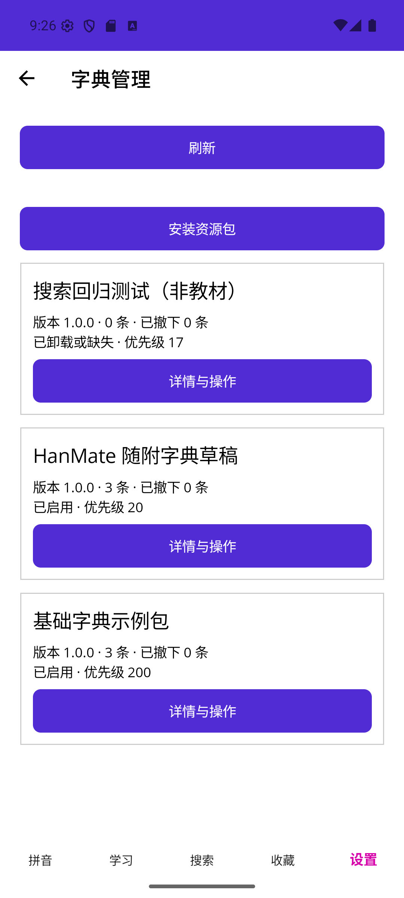

# W2-08 学习资源与字典管理

日期：2026-09-17。复用既有MAUI与SQLite工程，无Git元数据。交付管理页和无引用纯文字资源生命周期；不代表受引用快照卸载、音频GC或完整三平台验收完成。

## 实现

- 设置→管理内容显示所有资源，设置/搜索→字典管理只显示dictionary。独立信息卡显示名称、版本、数量、撤下数、存在/启停状态和优先级；详情显示来源、许可与正文数据字节数。
- 启停与优先级写入SQLite，校验epoch/rowRevision，收据和epoch同事务；页面成功后更新状态，返回搜索/学习重新加载。优先级仅影响同匹配等级来源顺序。
- 卸载预览识别收藏、音频、草稿及其嵌套UUID、教学引用、修改内容、retained与import mapping；缺失条目图也拒绝删除。执行在写事务内再次扫描，防止预览后新增引用但资源epoch未变。
- 只有无引用、未修改、完整纯文字资源可卸载；同事务删除映射/正文/索引/目标，写缺失登记和收据。保留descriptor、优先级和撤下偏好；没有音频文件删除或物理磁盘回收承诺。
- 随附资源显式恢复走固定嵌入ZIP/哈希可信入口；外部资源从原文件同版本同载荷重装。保持稳定ID、优先级和override，已有且停用的同包不会被重复安装偷偷启用。启动不恢复缺失资源。
- 不新增依赖、协议或数据库版本；resource_operation.update的setPriority action只表示元数据变更。随附草稿审校状态不变。

## 自动化与构建

| 验证 | 结果 |
|---|---|
| Infrastructure Release | PASS：75/75，新增12项资源管理用例 |
| Core Release | 本轮NOT RUN；前阶段140/140 PASS，Core未改 |
| Windows Release | PASS：0警告/0错误 |
| Android Release | PASS：0警告/0错误；最终APK覆盖安装保留数据 |
| iOS simulator managed目标，Windows宿主 | PASS：0警告/0错误；不是Mac/Xcode原生运行 |
| 三语言resx | PASS：172键、非空值与格式占位符一致 |

新增ResourceManagementTests覆盖真实SQLite：优先级改变真实搜索顺序/持久化/过期操作/非法值；随附卸载后启动不重装、显式恢复保持稳定ID/优先级77/override/递增修订；外部同包重装幂等；收藏、音频、草稿目标、含大写UUID的嵌套token、教学、修改内容及retained七种保护；预览后增加引用重新阻止；触发器故障导致卸载/优先级操作整体回滚；取消、不完整资源、过期预览拒绝。

实际验证命令：

```text
dotnet test HanMate.Infrastructure.Tests/HanMate.Infrastructure.Tests.csproj -c Release --no-restore
dotnet build HanMate.App/HanMate.App.csproj -c Release -f net10.0-android --no-restore
dotnet build HanMate.App/HanMate.App.csproj -c Release -f net10.0-windows10.0.19041.0 --no-restore
dotnet build HanMate.App/HanMate.App.csproj -c Release -f net10.0-ios --no-restore
```

## Android聚焦运行

Android16/API36，emulator-5554，Release。使用此前61词工程字典“搜索回归测试（非教材）”，resourceId `20a2c017-c411-5bcc-aabb-740925b877eb`，文件`/sdcard/Download/search-smoke.zip`；source仍draft/testFixture，不计正式教材。原93条包括23条随附、7条旧外部夹具、2条阅读器测试和61条搜索测试。

1. nihao原55条。从搜索进入字典管理，停用测试字典，返回保留查询并显示无结果；重新启用成功。
2. 将优先级200改17，详情和列表立即显示17。
3. 卸载预览显示61条；取消后仍61条。重新确认卸载后0条/0文字字节，状态缺失，启用不可用，显示“从原文件重新安装”。其余32条保留。
4. 安装最终APK并重新启动，测试字典仍缺失、优先级17，其他字典完整；没有启动自动重装。
5. 原先列表按钮截掉版本/数量，修复为独立标签和操作按钮；最终截图实际检查，名称/版本/数量/状态/优先级可见。
6. 点击从原文件重新安装，经系统选择器选择原search-smoke.zip，预览名称/版本/61条后确认。页面报告安装61条；返回详情已启用、61条、230,689文字字节、优先级17。nihao重新命中55条（首屏1—50），总库恢复93条。
7. 英文管理内容列表显示英文资源名、Enabled/Priority及Details and actions；日语字典列表显示对应语言。完成后恢复简中。此项是聚焦文案检查，不代替完整可访问性/语言用例。



## 未完成边界

W2-08 DONE；R19/R20继续IN_PROGRESS。单条撤下/恢复UI、受引用资源retained迁移、版本更新、含音频包安装/文件回收、分享/完整备份仍待后续。文字字节数不表示SQLite或App实际释放空间。Windows新管理交互、iOS原生运行、Android真机、完整软键盘/IME/无障碍和176项全量用例均NOT RUN；此前Windows工具阻塞本轮未重试。

拼音录音仍6/161、155缺口，本轮未重新研究下载，不提升教学审校状态。下一阶段建议接W2-02/W2-06分类与收藏。
