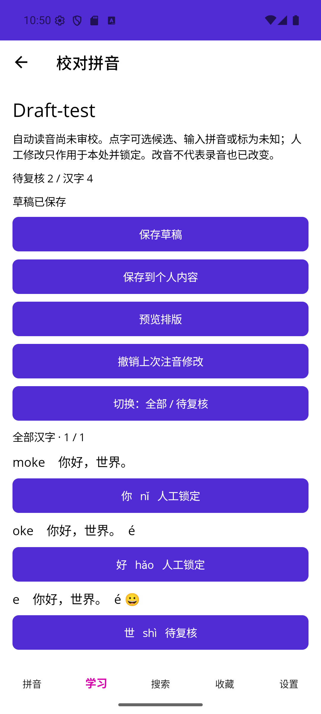

# 离线注音、人工改音、个人保存与语法表单

日期：2026-09-17。用户要求多阶段连续实施，测试集中收尾。W3-02/W3-03 DONE；W3-07 IN_PROGRESS；19/48任务DONE，不等于176项全量验收通过。

## 资源与生成

固定 [Unicode 17 Unihan](https://www.unicode.org/Public/17.0.0/ucd/Unihan.zip)，读取文件头确认17.0.0、2025版权，完整检查 [Unicode License V3](https://www.unicode.org/license.txt)。ZIP缓存 tools/resource-audit/unicode17；tools/build_annotation_lexicon.py离线解析kMandarin和kHanyuPinyin、去重并排序。只生成字音候选，不引入释义或在线依赖。

| 项目 | 值 |
|---|---|
| 原ZIP SHA256 | f7a48b2b545acfaa77b2d607ae28747404ce02baefee16396c5d2d7a8ef34b5e |
| Unihan_Readings.txt SHA256 | 575e69c9ad85a4737a889a4f94cbd987042a90a1a6cc16dd3f4ed995c715b17c |
| 派生TSV SHA256 | 4f9469160804bac06370e7850867194c7e36ca66e8bf7f54820c2b6b0568268e |
| 原数据 | 44,350字，55,328条不同读音 |
| 当前解析器接受 | 44,347字，55,301条读音 |
| 暂不支持 | 27条成音节m/n/ng/ê带调形式；逐条由UnsupportedReadings报告 |
| 上下文种子 | 24条原创事实读音，如银行/行走、音乐/快乐、重新/重量、长大/长度；全部needsReview |

Infrastructure/Pinyin嵌入TSV、许可证与source manifest。单字多候选不随机挑一个，缺失或不支持形式不替换成近似音。特殊音节继续保留需求，不以跳过27条宣称完整覆盖。首轮测试发现兼容汉字补充区未识别，补上U+2F800—U+2FA1F后，灰的huī正常进入候选。未提升随附教材审校状态。教学音频仍6/161，本轮没有新增录音。

## 实现边界

- v1原文草稿兼容读取，生成后显式保存v2。包含原文、grammar表单、当前及上次注音快照、词典版本、个人正文期望修订。输入改变取消后台结果，取消不会替换已有草稿；20,000文本元素/1MiB约束沿用。
- 原文按文本元素投影，完整覆盖混排、换行、空行、组合字符及扩展汉字。单字token稳定UUID；speech/layout片段覆盖原文。word最多64元素；grammar包含最少一说明和一例句，花括号槽位只存patternParts，不生成朗读目标。
- 逐字候选/手输/未知锁定，轻声明确0/5，裸nu不能默认为轻声；单步撤销、48字分页和待复核过滤。未知锁定在重生成后继续保留；不把全部同形字一起修改。
- 文本差异以唯一不变句段与唯一公共前后缀映射。映射冲突拒绝猜测；改动或多义范围先显示将重生成的人工数量并确认，旧版本可撤销。标题不改变正文身份。复杂多次编辑中部范围仍可保守退回复核，不运行无界O(n²)diff。
- EditorCommitStore严格验证content.schema及内容图，再在同一SQLite事务写正文、搜索索引、epoch、targets、audio review_state并完成草稿。提交核对持久draft body及revision；既有正文只允许匹配修订的personal。失败不删除草稿，不创建半条正文。
- 新/改目标使用与安装器一致的规范text/pronunciation哈希，绑定和资产保持。读音变化仅使不匹配音轨needsReview；前方插入不改变唯一未变片段的ID/相对读音哈希。删除有音轨的旧目标时整笔拒绝，用户可另存新图，不猜测拆并音轨迁移。
- 资源编辑通过全图UUID复制，不覆盖源资源，也不复制收藏/音频。保留原来源、权限边界；个人新输入使用NOASSERTION和未审校状态，不自行开放分享权限。
- 原文编辑目前覆盖单unit word/text/poem、单说明+单例句grammar；复杂词语/语法图提供已有token校正而不截断额外unit。多例句/注记/翻译/主题表单、删除影响与完整分享准备仍待W3-07。

## 集中检查

| 检查 | 结果 |
|---|---|
| Core Release | PASS 162/162；较上阶段新增14项 |
| Infrastructure Release | PASS 92/92；较上阶段新增9项 |
| Windows Release | PASS 0警告/0错误 |
| Android Release | PASS 0警告/0错误；保留数据覆盖安装 |
| iOS simulator managed，Windows宿主 | PASS 0警告/0错误；不代表Mac/Xcode/原生运行 |
| resx | PASS 271键三语言一致、非空、数字占位符一致 |

用例覆盖Unicode精确范围/重复文段/唯一前后缀位移、人工单处锁定/显式未知、裸声调拒绝、grammar槽位/必填/引用、取消/容量，以及真实SQLite正式提交/重复提交/过期草稿和正文/伪造草稿body/索引epoch/音频目标保护回滚/局部失效/完整资源复制/v1兼容。音频关联测试使用临时数据库元数据，不冒充真实录音或解码测试。

执行命令：Core与Infrastructure各自dotnet test -c Release；App分别-f net10.0-windows10.0.19041.0、net10.0-ios、net10.0-android -c Release构建；全部串行。修复编译期测试命名空间、测试引用错表名后通过，不删失败断言。

## Android实际操作

Android16/API36 emulator-5554，Release覆盖安装，不清库。

1. 恢复此前Draft-test TXT草稿（含空行、你好，世界、组合e+重音及emoji），点击离线注音进入校对页，4汉字均保持待复核。
2. 点“你”查看nǐ/手输/未知候选，选择nǐ后“你”显示人工锁定，待复核降为3；进入原生排版预览，拼音、中文和混排完整显示。
3. 正式保存前明确提示3字待复核，确认后在课文学习列表看到Draft-test；回到草稿列表已无该草稿，未被原文页面离开自动保存重新建立。
4. 新建Grammar-smoke，选择语法，输入英文工程说明、{S} is {N}和英文例句，生成/保存后在语法列表和阅读页显示说明、例句及结构槽位。该条只是表单工程测试，不是中文教材或审校证据；中文grammar图另有Core/SQLite用例。

5. 最终APK再次覆盖安装并强制重启后，个人课文仍在；由阅读页进入个人编辑，重生成后“你”的nǐ仍为人工锁定。锁定边界使相邻未确认“好”回退到多候选未知状态，未自动挑读音。
6. 对“你”手工输入无调nu，页面明确提示必须指定合法声调或未知，原nǐ锁定保持；再对“好”从hǎo/hào中选择hǎo，待复核降为2。截图已实际查看，显示两处锁定和待复核区分。
7. 收尾发现提交后使用已脱离栈的页面导航代理无法打开结果详情，改为捕获Shell导航对象执行PopToRoot/Push；不假设Shell隐式根在NavigationStack中是非空页面。最终三目标重新编译0警告错误、APK覆盖安装后，重启恢复Grammar-smoke，从阅读页进入编辑/重生成/保存，自动打开刚保存的正式语法详情，实际验证通过。最终停留该阅读页，简中和150%阅读字号保持。

Windows交互、iOS原生、Android真机、手机20k生成性能、通常软键盘/中文IME、读屏、满磁盘/强杀窗口与完整176项NOT RUN。
